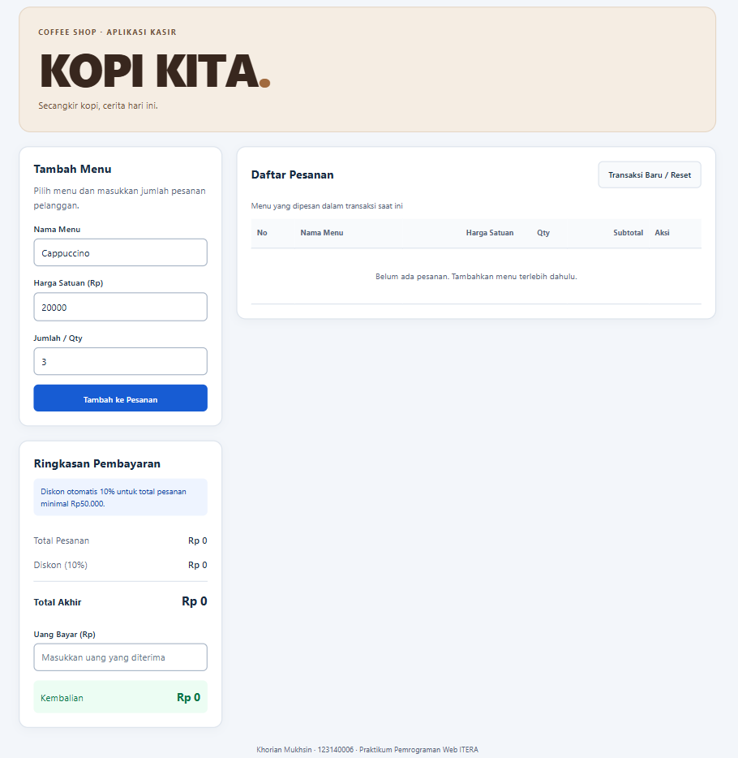
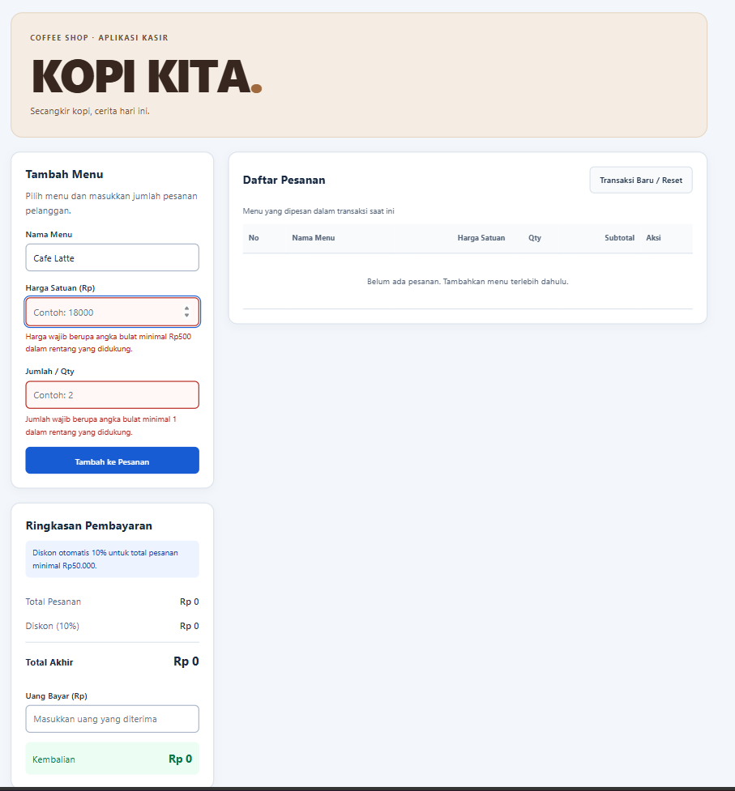
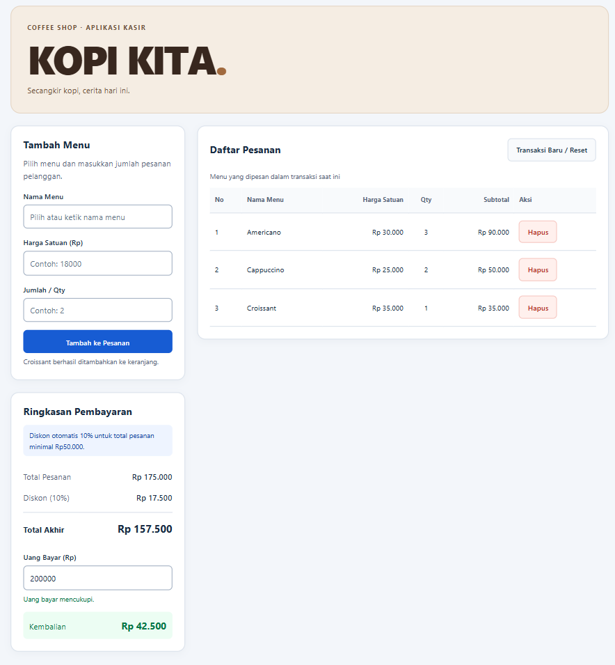

# KASIR KOPI KITA

## Identitas
| Keterangan | Identitas |
| --- | --- |
| Nama lengkap | Khorian Mukhsin |
| NIM | 123140006 |
| Kelas praktikum | **paw rb** |
| Program studi | Teknik Informatika, Institut Teknologi Sumatera |
| Pertemuan | 1 |

## Deskripsi Aplikasi

KASIR KOPI KITA merupakan aplikasi kasir dan keranjang belanja sederhana untuk kafe. Aplikasi membantu kasir mencatat menu, menghitung subtotal dan total belanja, memberikan diskon otomatis, serta menghitung kembalian. Proyek ini dibuat untuk mempraktikkan validasi form, perhitungan otomatis dengan JavaScript, dan pengelolaan daftar belanja menggunakan localStorage.

Aplikasi menggunakan HTML, CSS, dan JavaScript tanpa framework. Keranjang disimpan pada browser yang digunakan, bukan pada server atau database.

## Struktur Proyek

```text
pemrograman_web_itera_123140006/
└── khorianmukhsin_123140006_pertemuan1/
    ├── index.html
    ├── style.css
    ├── script.js
    ├── README.md
    ├── screenshots/
    │   ├── 01-tampilan-awal.png
    │   ├── 02-validasi-error.png
    │   └── 03-transaksi-dan-kembalian.png
    └── modul/
        └── [File latihan selama praktikum]
```

## Panduan Menjalankan

1. Unduh atau clone repository proyek.
2. Buka folder proyek menggunakan Visual Studio Code.
3. Pastikan `index.html`, `style.css`, dan `script.js` berada dalam folder pertemuan yang sama.
4. Pasang ekstensi **Live Server** jika belum tersedia.
5. Klik kanan `index.html`, lalu pilih **Open with Live Server**.
6. Aplikasi akan terbuka di browser. Tidak diperlukan proses build atau instalasi paket npm.

Alternatif: buka `index.html` langsung dengan browser. Live Server disarankan agar alamat aplikasi konsisten dan perilaku localStorage lebih mudah diuji. Selama pengujian, gunakan alamat dan port yang sama. Penyimpanan pada alamat, profil, atau browser berbeda tidak dibagikan.

## Daftar Fitur

- [x] Validasi nama barang wajib diisi dan minimal 3 karakter setelah spasi di awal/akhir dibuang.
- [x] Validasi harga satuan minimal Rp500; implementasi menggunakan angka bulat untuk rupiah utuh.
- [x] Validasi jumlah berupa angka bulat minimal 1.
- [x] Pesan validasi berwarna merah di bawah input yang salah.
- [x] Pencegahan penambahan barang jika input tidak valid.
- [x] Reset form otomatis setelah barang berhasil ditambahkan.
- [x] Tabel keranjang dengan nomor, nama, harga satuan, qty, subtotal, dan aksi.
- [x] Perhitungan subtotal: harga satuan dikalikan qty.
- [x] Akumulasi total belanja otomatis.
- [x] Diskon otomatis 10% jika total belanja mencapai Rp50.000.
- [x] Perhitungan total akhir, uang bayar, dan kembalian.
- [x] Pesan kekurangan pembayaran jika uang belum mencukupi.
- [x] Hapus barang dan perhitungan ulang otomatis.
- [x] Penyimpanan dan pemuatan keranjang menggunakan localStorage.
- [x] Tombol Transaksi Baru / Reset untuk mengosongkan keranjang dan menghapus data tersimpan.
- [x] Format mata uang Rupiah dan tampilan responsif.
- [x] Penanganan JSON rusak, penyimpanan gagal, dan angka di luar rentang aman JavaScript.

Checklist di atas menunjukkan fitur yang sudah diimplementasikan. Fitur kalkulator keuangan pada studi kasus ini berupa total, diskon, pembayaran, dan kembalian.

## Tangkapan Layar

### 1. Tampilan Form Input Utama

Tampilan awal menunjukkan form input barang, tabel keranjang kosong, dan ringkasan pembayaran.



### 2. Tampilan Validasi Error

Klik tombol **Tambah ke Keranjang** saat form kosong. Pesan merah akan muncul di bawah harga dan jumlah.



### 3. Hasil Perhitungan dan Tabel Keranjang



## Penjelasan Teknis

### Validasi Input

Event `submit` pada form ditangani dengan `event.preventDefault()` agar halaman tidak dimuat ulang. Fungsi `validasiBarang()` membaca nilai input, menghapus spasi di awal dan akhir nama menggunakan `trim()`, lalu memeriksa panjang nama, harga, dan jumlah. `Number.isSafeInteger()` memastikan harga dan qty berupa angka bulat dalam rentang aman. Subtotal serta akumulasi total juga diperiksa agar tidak melampaui rentang tersebut.

Jika input salah, `tampilkanError()` mengisi elemen pesan di bawah input dan mengatur `aria-invalid`. Fokus diarahkan ke input salah yang pertama, dan barang tidak ditambahkan. Jika valid, objek `{ nama, harga, qty }` dimasukkan ke array `keranjang`, disimpan, dan ditampilkan. Form kemudian dikosongkan dengan `form.reset()`.

### Perhitungan Keuangan

`hitungTotal()` menggunakan `reduce()` untuk menjumlahkan hasil perkalian harga dengan qty. `hitungPembayaran()` menghitung diskon dan total akhir, lalu menjalankan `hitungKembalian()`.

```text
Subtotal = harga satuan × qty
Total belanja = jumlah seluruh subtotal
Diskon = pembulatan(total belanja × 10%) jika total belanja ≥ Rp50.000
Total akhir = total belanja − diskon
Kembalian = uang bayar − total akhir, jika pembayaran mencukupi
```

Diskon dibulatkan ke rupiah terdekat menggunakan `Math.round()`. Jika uang kurang, sistem menampilkan nominal kekurangan dan menampilkan kembalian Rp0. Input uang bayar dipantau melalui event `input`, sehingga hasil berubah otomatis saat kasir mengetik. Tampilan Rupiah memakai `Intl.NumberFormat("id-ID")`.

Catatan batas harga: persyaratan fitur menyebut minimal Rp500, sedangkan tabel penilaian menyebut `> 500`. Implementasi mengikuti persyaratan fitur: Rp500 diterima. Harga dan uang bayar menggunakan rupiah bulat.

### Pengelolaan Tabel

`renderKeranjang()` membangun ulang tabel berdasarkan array `keranjang`. Elemen dibuat dengan `document.createElement()` dan nama barang ditampilkan menggunakan `textContent`, sehingga input nama diperlakukan sebagai teks. Setiap baris memiliki tombol Hapus yang memanggil `hapusBarang(index)`. Penghapusan menggunakan `splice()`, kemudian penyimpanan dan perhitungan diperbarui.

### Serialisasi localStorage

Keranjang menggunakan key `mini-pos-123140006-keranjang`. `simpanKeranjang()` mengubah array menjadi string JSON:

```javascript
localStorage.setItem(STORAGE_KEY, JSON.stringify(keranjang));
```

Saat halaman dibuka, `muatKeranjang()` membaca string dan mengubahnya menjadi data JavaScript:

```javascript
const dataTersimpan = localStorage.getItem(STORAGE_KEY);
const data = JSON.parse(dataTersimpan);
```

Kode memeriksa keberadaan data sebelum menjalankan `JSON.parse()`, memvalidasi struktur data hasil pembacaan, dan menangani kegagalan dengan `try...catch`. Hanya nama, harga, dan qty yang disimpan; subtotal dan diskon dihitung ulang. Uang bayar tidak disimpan dan kembali kosong setelah refresh.

Tombol reset mengosongkan array dan menghapus key aplikasi menggunakan `localStorage.removeItem(STORAGE_KEY)`. `localStorage.clear()` tidak digunakan agar data aplikasi lain pada alamat yang sama tidak ikut terhapus. Aplikasi hanya menyimpan transaksi aktif, bukan arsip transaksi yang sudah selesai.
